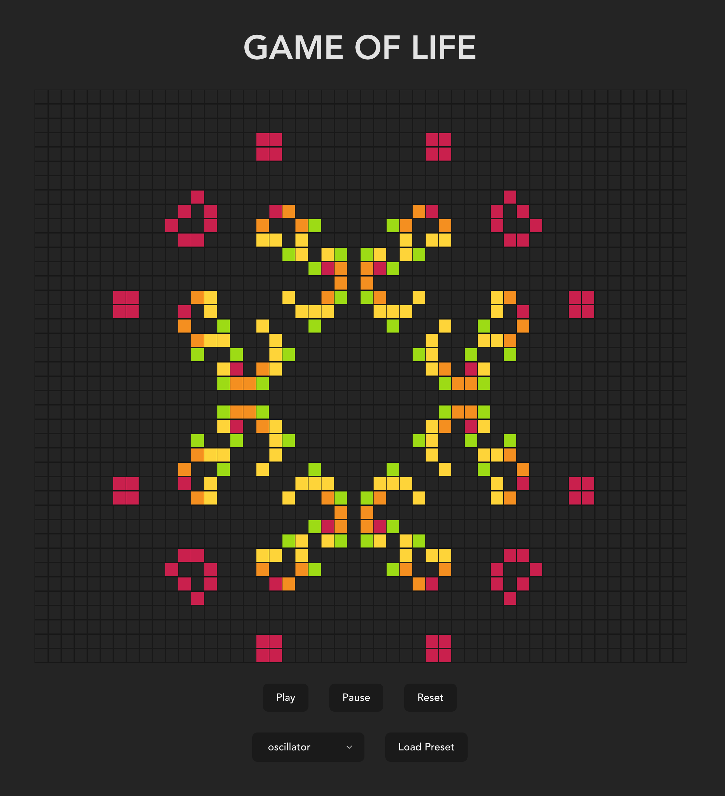

# Game Of Life

Conway's Game of Life simulates the birth and death of cells on a rectangular grid.

The state of a given cell in any generation depends on the state of the cell and its eight immediate neighbors in the preceding generation, according to some simple rules:

- If a living cell has two or three neighbors, it remains living; otherwise it dies of loneliness or overcrowding.
- If an empty cell has exactly three neighbors, it becomes living; otherwise, it remains dead.

As simple as these rules may be, they can result in surprising complexity from relatively simple initial configurations.

See it running at https://marc-roig.github.io/game-of-life/

